# WireGuard Hub on VPS

**A containerized WireGuard gateway designed to connect roaming devices with your home network, bypassing ISP restrictions like CGNAT.**

This repository automates the deployment of a WireGuard server on VPS environments (Oracle Cloud, AWS, Debian/Ubuntu). It handles the full stack: system network patching, Docker installation, and automated peer/QR code generation.

```mermaid
graph TD
    %% Styles
    classDef client fill:#263238,stroke:#80deea,stroke-width:2px,color:#fff,font-size:30px
    classDef vps fill:#0d47a1,stroke:#40c4ff,stroke-width:3px,color:#fff
    classDef home fill:#212121,stroke:#ffab00,stroke-width:2px,color:#fff
    classDef internet fill:none,stroke:none,color:#fff,font-size:50px

    %% Graph
    subgraph Clients ["Your external devices"]
        PC["🖥️"]:::client
        Mobile["📱"]:::client
        Laptop["💻"]:::client
    end

    PC     <-- "WireGuard<br/>Tunnel" --> VPS
    Mobile <-- "WireGuard<br/>Tunnel" --> VPS
    Laptop <-- "WireGuard<br/>Tunnel" --> VPS

    VPS["☁️<br/>VPS Server"]:::vps -- "NAT / Masquerade<br/>(Public IP)" --> Internet((🌐)):::internet
    
    VPS <-- "WireGuard<br/>Tunnel" --> Home
    
    subgraph HomeNet ["Your home network"]
        Home["🏠<br/>Home<br>server"]:::home
        Home <--> Services["👾<br/>Self-hosted<br/>services"]:::home
    end

    %% Subgraphs
    style Clients fill:#121212,stroke:#546e7a,stroke-width:2px,stroke-dasharray: 5 5,color:#eceff1
    style HomeNet fill:#121212,stroke:#ef6c00,stroke-width:2px,color:#eceff1
    linkStyle 0,1,2,3,4,5 stroke:#b0bec5,stroke-width:2px,color:#cfd8dc
```



> [!IMPORTANT]
> **Network Host Mode**
>
> Unlike standard Docker deployments, this project runs WireGuard in `network_mode: host`.
>
> This is a deliberate choice to:
> - **Ensure Stability:** Bypass UDP Checksum Offloading bugs common in KVM/Oracle Cloud.
> - **Maximize Performance**
> - **Preserve Real IPs**

## Prerequisites

- VPS with Ubuntu/Debian OS
- SSH access to the server
- UDP port 51820 open

## Installation

### 1. Configure VPS Firewall

Access your VPS provider's firewall/security settings and:

- **OPEN UDP 51820 port** (Source: `0.0.0.0/0`)
- Ensure the server's network configuration allows host network mode

### 2. Clone the repository

Connect via SSH, clone this repository and enter the directory.

```bash
git clone https://github.com/ruizmaa-homelab/docker-wireguard-hub.git
cd docker-wireguard-hub
```

### 3. Choose one of the following installation methods:

#### A: 🚀 Quick Start (automated)

Recommended for fresh VPS installations. This script handles the full lifecycle: installs Docker, auto-detects your Public IP, updates configuration, starts the container, and applies network patches.

```bash
sudo ./scripts/easy-install.sh
```

Now you can just connect your devices with the QR code.

```bash
./wireguard.sh qr 1
```

Or copy the configuration file to your device

```bash
./wireguard.sh conf-file 1
```

---

#### B: 🛠️ Manual / Modular Installation

Recommended if you want full control and customization

##### 1. Install Dependencies

Installs Docker and system tools.

```bash
sudo ./scripts/basic-install.sh
```

##### 2. Configure

Edit the compose file to set your `SERVERURL` (IP or Domain), `INTERNAL_SUBNET`, `PEERS`, `PEERDNS`, `TZ` and so more...

You can take a quick look at the [configuration section](#configuration) below or check the [image documentation](https://github.com/linuxserver/docker-wireguard).

```bash
nano docker-compose.yml
```

##### 3. Apply Network Fixes

Start the container to generate keys and configuration files. Once the container is up and the configuration files are created, run this script to patch the host kernel settings, MTU, and Firewall rules.

```bash
./wireguard.sh start

# Wait for config generation
while [ ! -f "./config/wg_confs/wg0.conf" ]; do
    sleep 1
done

# Apply fixes
sudo ./scripts/fix-vps-net.sh
./wireguard.sh restart
```

##### 4. Connect your devices

Finally you can connect your devices.

```bash
# Get QR
./wireguard.sh qr 1

# Get configuration file
./wireguard.sh conf-file 1
```

## Configuration

The WireGuard interface is configured via environment variables in `docker-compose.yml`:

| Variable | Default | Description |
| :--- | :--- | :--- |
| `PUID` / `PGID` | `1000` | User and Group IDs. Should match the host user to avoid permission issues with volumes. |
| `TZ` | `Etc/UTC` | Timezone for the container logs (e.g., `Europe/Madrid`). |
| `SERVERURL` | `auto` | **Required.** External IP or Domain. The installation script sets this to your Public IP automatically. |
| `SERVERPORT` | `51820` | External UDP port. Must be open in your Cloud Provider's firewall. |
| `PEERS` | `1` | Number of peers to generate (e.g., `2`) or a list of names (e.g., `phone,laptop`). |
| `PEERDNS` | `auto` | DNS server for clients. If unset (`auto`), uses the container's CoreDNS. |
| `INTERNAL_SUBNET` | `10.13.13.0` | Internal VPN IP range. Change only if it clashes with your local network. |
| `ALLOWEDIPS` | `0.0.0.0/0` | Defines routing. `0.0.0.0/0` forces **Full Tunnel** (all traffic goes through VPN). |
| `PERSISTENTKEEPALIVE_PEERS` | `all` | Set to `all` (or a list of peers) to send "ping" packets every 25s to keep the tunnel open. |
| `LOG_CONFS` | `true` | If `true`, outputs the QR codes to the Docker logs on startup. |
